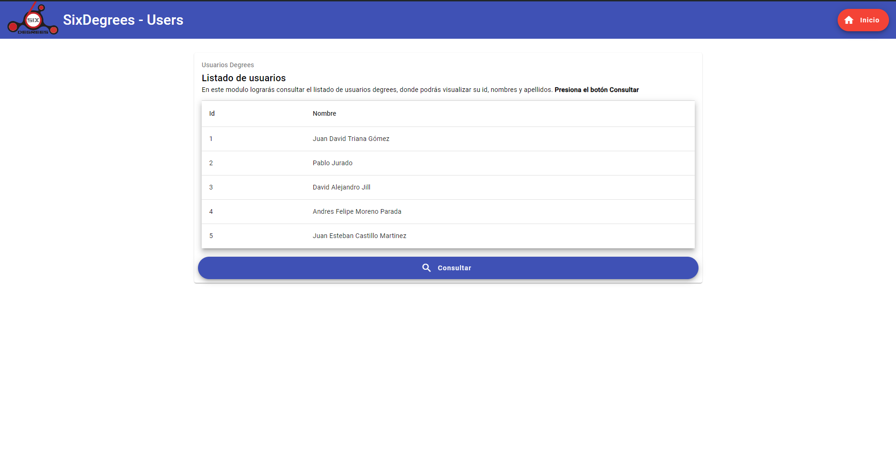

# SixDegrees - Usuarios

## Descripción

SixDegrees - Users es una aplicación frontend desarrollada con Angular 17 y Angular Material 17.3. El propósito de la aplicación es cargar y mostrar una lista de usuarios obtenidos de un servicio backend. El proyecto sigue una arquitectura modular y utiliza buenas prácticas como la organización de código en carpetas según su funcionalidad y el uso de variables de entorno.

## Características

- **Tecnología:** Angular 17 con Angular Material 17.3
- **Arquitectura:** Estructura modular con componentes re-utilizables.
- **Funcionalidad principal:** Cargar y mostrar datos de usuarios.
- **Diseño responsivo:** Utilizando Angular Material para una mejor experiencia de usuario.

## Pantallazo

  <!-- Reemplaza con la ruta correcta -->

## Estructura del Proyecto

La estructura del proyecto se organiza en diferentes carpetas para mantener un código limpio y modular:

- **screens/home:** Contiene el módulo principal de la aplicación, donde se maneja la tabla de usuarios y otras funcionalidades relacionadas.
- **shared:**
  - **components:** Contiene los componentes re-utilizables que se pueden utilizar en varias partes de la aplicación.
  - **constant:** Almacena todas las constantes y valores que reemplazan los *magic strings* en el código.
  - **interfaces:** Contiene todas las interfaces utilizadas en la aplicación, incluyendo las que definen las peticiones al backend.
  - **material:** Agrupa todos los módulos de Angular Material que se utilizan en la aplicación.
  - **service:** Contiene todos los servicios que se encargan de la lógica de negocio y las peticiones HTTP.

## Instalación

Sigue los pasos a continuación para configurar y ejecutar el proyecto en tu entorno local:

1. **Clona el repositorio:**

   ```bash
   git clone https://github.com/JuanTG08/Sixdegreesit-test-frontend
   cd Sixdegreesit-test-frontend
   ```

2. **Instala las dependencias:**
   Asegúrate de tener *Node.js* instalado y luego ejecuta:
   ```bash
   npm install
   ```

3. **Configuración de Variables de Entorno:**
   El proyecto utiliza variables de entorno para la configuración. Estas se encuentran en el archivo `src/environments/environment.ts`. Puedes modificarlo según tu entorno de desarrollo.
   ```typescript
   export const environment = {
      apiUrl: 'http://localhost:3000/api',
   };
   ```
4. **Ejecutar la aplicación:**
   ```bash
   ng serve
   ```
   Luego abre tu navegador y navega a `http://localhost:4200/`.

## Uso
1. Navega a la página principal de la aplicación.
2. Haz clic en "Consultar" para cargar la lista de usuarios desde el backend.
3. Verás la lista de usuarios en la tabla con sus respectivos ID, nombre y apellido.